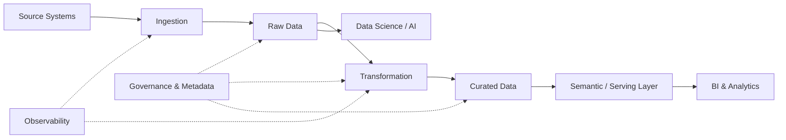

# Architecture Output Template

Use this template to structure the final architecture recommendation.

Adapt the level of detail to the complexity of the problem. Do not create
sections or architectural components that are not relevant to the scenario.

The output should make it possible to understand:

1. what is being proposed;
2. why it is being proposed;
3. which requirements drove the design;
4. which alternatives were considered;
5. what trade-offs and risks remain.

---

# Data Architecture Recommendation

## 1. Executive Summary

Provide a concise summary of:

- the business problem;
- the proposed architectural approach;
- the primary reasons for the recommendation;
- the most important trade-offs.

Keep this section understandable to both technical and non-technical
stakeholders.

Do not introduce technologies here unless they are fundamental to the
recommendation.

---

## 2. Context and Business Drivers

### Business Objective

Describe the business outcome the architecture is intended to support.

### Primary Use Cases

List the main use cases.

### Data Consumers

Identify relevant consumers, such as:

- business intelligence;
- analysts;
- data scientists;
- operational applications;
- APIs;
- AI/ML systems;
- external consumers.

### Business Constraints

Document relevant organizational, regulatory, financial, or delivery
constraints.

---

## 3. Requirements and Assumptions

### Known Requirements

Document confirmed requirements that materially influence the architecture.

### Assumptions

Explicitly identify assumptions made because information was unavailable.

For each important assumption, indicate whether changing it could alter
the architecture.

Example:

| Assumption | Architecture impact if incorrect |
|---|---|
| Hourly data freshness is sufficient | Streaming or CDC may need evaluation |
| Platform will run in one cloud | Integration and portability design may change |
| Data volume remains below expected growth range | Processing strategy may need revision |

### Open Questions

List unresolved questions that could materially affect the recommendation.

Do not fill this section with questions that have no architectural impact.

---

## 4. Architecturally Significant Quality Attributes

Identify only the quality attributes that materially influence this
architecture.

Example:

| Quality Attribute | Requirement / Expectation | Priority | Architecture Impact |
|---|---|---|---|
| Data freshness | Data available within 30 minutes | Critical | Influences ingestion strategy |
| Governance | End-to-end lineage required | Critical | Metadata and lineage capabilities required |
| Availability | Business-hours analytics | Important | Does not justify complex HA design |
| Portability | Moderate | Desirable | Prefer portable storage formats where practical |

Use:

- **Critical**
- **Important**
- **Desirable**
- **Not architecturally significant**

Avoid vague requirements such as "highly scalable" or "real-time."

---

## 5. Recommended Architecture

### Architecture Style

Identify the primary architectural pattern or combination of patterns.

Examples:

- Modern Data Warehouse;
- Lakehouse;
- Batch-oriented analytical platform;
- Event-driven data platform;
- Hybrid batch and streaming architecture;
- Federated data platform.

Explain why the pattern fits the requirements.

### Architecture Overview

Describe the architecture from source to consumption.

Explain the role of each major capability without immediately focusing on
specific products.

---

## 6. Logical Architecture

Represent the logical architecture using a Mermaid diagram when the
environment supports Mermaid.

Example:



Adapt the diagram to the actual architecture.

Do not add layers merely to make the diagram appear more sophisticated.

If Mermaid is unavailable, provide a clear text-based architecture instead.

---

## 7. Component Responsibilities

For each significant architectural capability, explain its responsibility.

Use a structure such as:

### Ingestion

**Responsibility:**  
Describe what the capability does.

**Requirements addressed:**  
Identify the requirements or quality attributes that justify it.

**Design considerations:**  
Explain relevant implementation considerations.

Repeat only for capabilities that exist in the proposed architecture.

Possible capabilities include:

- ingestion;
- event streaming;
- storage;
- processing;
- transformation;
- orchestration;
- serving;
- semantic layer;
- APIs;
- governance;
- metadata;
- security;
- data quality;
- observability;
- AI/ML integration.

---

## 8. Technology Mapping

Map logical capabilities to suitable technologies only after the logical
architecture has been established.

Example:

| Capability | Recommended Technology | Alternatives | Rationale |
|---|---|---|---|
| Object storage | Technology A | Technology B | Fits scale, cost and ecosystem constraints |
| Transformation | Technology C | Technology D | Matches team skills and workload characteristics |
| Orchestration | Technology E | Technology F | Provides required scheduling and observability |

Technology recommendations must be justified.

Do not select products solely because they belong to the same vendor
ecosystem.

Where appropriate, identify:

- managed vs self-managed implications;
- licensing implications;
- portability;
- vendor lock-in;
- operational skills required.

---

## 9. Data Flow

Describe how data moves through the architecture.

For each significant flow, identify:

1. source;
2. ingestion mechanism;
3. processing or transformation;
4. persistence;
5. consumption;
6. expected latency where relevant.

Example:

```text
CRM
  -> scheduled incremental ingestion
  -> raw storage
  -> validation and standardization
  -> curated customer model
  -> semantic layer
  -> BI dashboards
```

For event-driven flows, also consider:

- event ordering;
- duplication;
- replay;
- retention;
- schema evolution.

---

## 10. Security and Privacy

Describe relevant security controls.

Consider where applicable:

- identity and authentication;
- authorization;
- least privilege;
- encryption;
- secrets management;
- network controls;
- audit logging;
- sensitive data;
- masking;
- retention;
- data residency.

Do not state only that the architecture is "secure."

Explain the controls relevant to the scenario.

---

## 11. Governance, Metadata and Data Quality

Describe how the architecture addresses:

- data ownership;
- catalog and discovery;
- classification;
- lineage;
- business glossary;
- data quality;
- data contracts where relevant;
- policy enforcement;
- remediation responsibilities.

Separate governance processes from governance technology.

A catalog does not replace ownership or accountability.

---

## 12. Observability and Operations

Explain how the platform will be operated.

Consider:

- pipeline monitoring;
- data freshness;
- data quality monitoring;
- logging;
- metrics;
- alerting;
- failure handling;
- retry and replay;
- cost monitoring;
- operational ownership.

Identify important operational failure scenarios.

---

## 13. Architectural Decisions

Summarize the most significant decisions.

Example:

| ID | Decision | Primary Driver | Confidence |
|---|---|---|---|
| ADR-001 | Batch ingestion for ERP data | 4-hour freshness requirement | High |
| ADR-002 | Lakehouse storage model | Mixed BI and data science workloads | Medium |
| ADR-003 | Managed orchestration | Small platform operations team | High |

Provide detailed ADRs for decisions that materially shape the architecture.

---

## 14. Architecture Decision Records

Use the ADR structure defined in:

`references/decision-framework.md`

Example:

### ADR-001 — Use Batch Ingestion for ERP Data

**Status:** Proposed

**Context:**  
ERP data is required for analytical reporting. The business requires data
to be available within four hours of source updates.

**Decision:**  
Use scheduled incremental batch ingestion.

**Drivers:**

- four-hour freshness requirement;
- predictable source update pattern;
- operational simplicity;
- cost efficiency.

**Alternatives considered:**

- Change Data Capture;
- event streaming.

**Rationale:**  
The required freshness can be satisfied without introducing continuous
processing infrastructure.

**Consequences:**

Positive:

- simpler operations;
- lower platform complexity;
- easier replay.

Negative:

- data is not immediately available after source changes.

**Risks:**  
Future operational use cases may require lower latency.

**Confidence:** High

**Revisit when:**  
Business requirements require materially lower data latency.

---

## 15. Alternatives Considered

Summarize credible architecture-level alternatives that were not selected.

Example:

| Alternative | Why Considered | Why Not Preferred |
|---|---|---|
| Traditional Data Warehouse | Simple BI architecture | Less suitable for heterogeneous analytical workloads |
| Full streaming architecture | Lowest data latency | Business requirements do not justify complexity |
| Multi-platform architecture | Workload specialization | Operational overhead exceeds current benefit |

Do not manufacture alternatives that were never credible.

---

## 16. Trade-offs

Make the major trade-offs explicit.

Examples:

### Simplicity vs Real-Time Capability

The architecture favors operational simplicity because the required
freshness can be satisfied through scheduled processing.

### Managed Services vs Portability

Managed services reduce operational overhead but increase dependency on
the selected cloud platform.

### Centralization vs Domain Autonomy

Centralized capabilities improve governance consistency but may reduce
domain independence.

Every significant architectural advantage should be considered together
with its cost or limitation.

---

## 17. Risks and Mitigations

Document material architectural risks.

Example:

| Risk | Impact | Mitigation |
|---|---|---|
| Source schema changes | Pipeline failures | Schema monitoring and data contracts |
| Platform skill gap | Operational risk | Training and managed services |
| Unexpected data growth | Performance degradation | Capacity monitoring and scalable storage |
| Vendor dependency | Migration complexity | Portable formats and explicit abstraction boundaries |

Avoid generic risks unrelated to the proposed architecture.

---

## 18. Implementation Roadmap

When requested or useful, propose an incremental implementation approach.

Prefer evolutionary delivery over a large platform build when possible.

Example:

### Phase 1 — Foundation

- platform baseline;
- identity and security;
- initial ingestion;
- storage;
- CI/CD;
- observability baseline.

### Phase 2 — First Data Product / Use Case

- implement one end-to-end use case;
- validate architecture assumptions;
- establish quality controls;
- gather operational evidence.

### Phase 3 — Scale

- onboard additional sources;
- introduce reusable patterns;
- strengthen governance;
- optimize performance and cost.

### Phase 4 — Advanced Capabilities

Introduce capabilities such as streaming, ML, or additional serving
patterns only when justified by requirements.

---

## 19. Validation Checklist

Before finalizing the architecture, verify:

- [ ] Business objectives are clear.
- [ ] Major requirements are documented.
- [ ] Assumptions are explicit.
- [ ] Architecturally significant quality attributes are identified.
- [ ] Every major component has a purpose.
- [ ] A simpler architecture was considered.
- [ ] Technology selection followed logical architecture design.
- [ ] Alternatives were evaluated.
- [ ] Trade-offs are explicit.
- [ ] Security and privacy are addressed.
- [ ] Governance and lineage are addressed where required.
- [ ] Data quality responsibilities are defined.
- [ ] Observability and operations are considered.
- [ ] Significant decisions are documented.
- [ ] Risks and mitigations are visible.
- [ ] Open questions that could change the architecture are identified.

---

## Final Recommendation

Conclude with a concise statement covering:

**Recommended approach**  
What should be built?

**Why**  
Which requirements make this the preferred architecture?

**Primary trade-off**  
What is the most important compromise being accepted?

**Next validation step**  
What should be confirmed, tested, or measured before implementation?

The final recommendation should be understandable without reading the entire
document.
